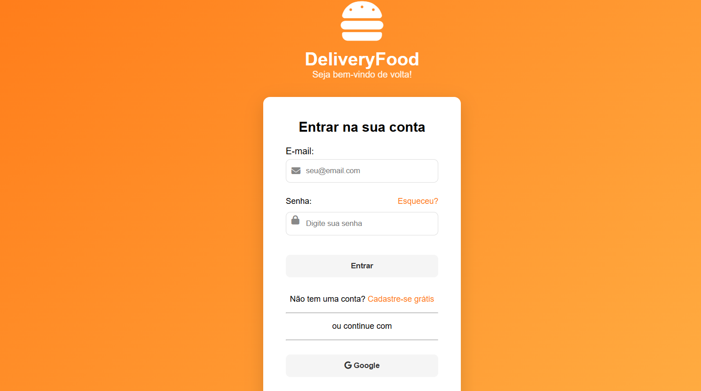

# 🍔 DeliveryFood - Tela de Login

Este projeto é uma **interface de login para um aplicativo fictício de delivery de comida chamado DeliveryFood**.

A aplicação foi desenvolvida com o objetivo de **praticar HTML e CSS**, criando uma interface moderna inspirada em aplicativos reais de delivery.

---

## 🚀 Tecnologias utilizadas

- HTML5
- CSS3
- Font Awesome

---

## ✨ Funcionalidades

- Tela de login moderna
- Campo de e-mail
- Campo de senha
- Ícones dentro dos inputs
- Botão de login
- Opção de login com Google
- Opção de login com Facebook
- Layout centralizado

---

## 🎯 Objetivo do projeto

Este projeto foi desenvolvido como parte dos meus estudos em **desenvolvimento web**, com foco na criação de interfaces modernas e organização de projetos para portfólio.

---

## 📸 Preview

Interface inspirada em aplicativos de delivery.

---

## 👨‍💻 Autor

Desenvolvido por **Luiz**
